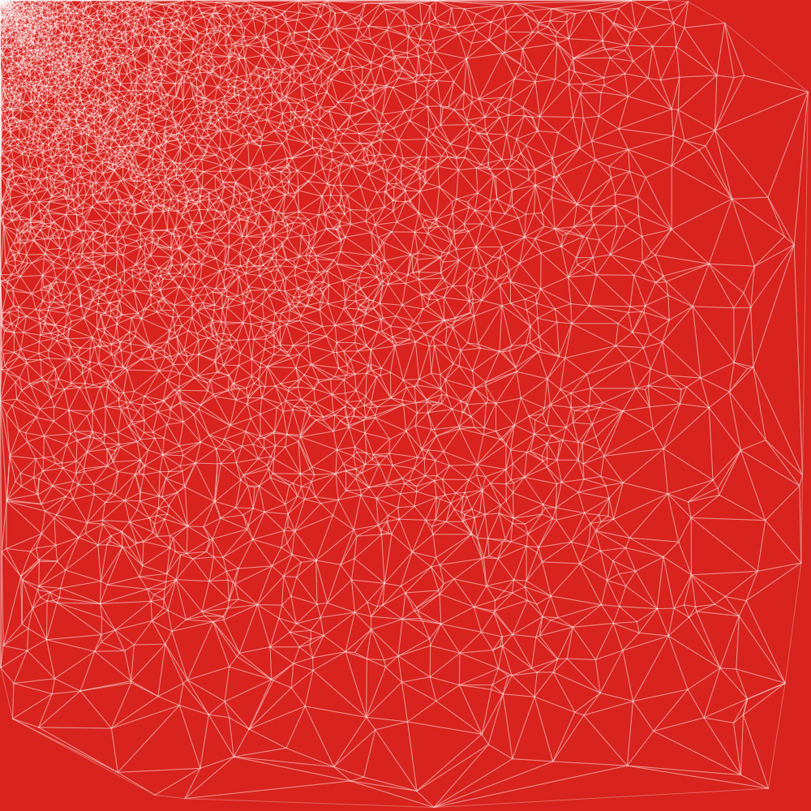
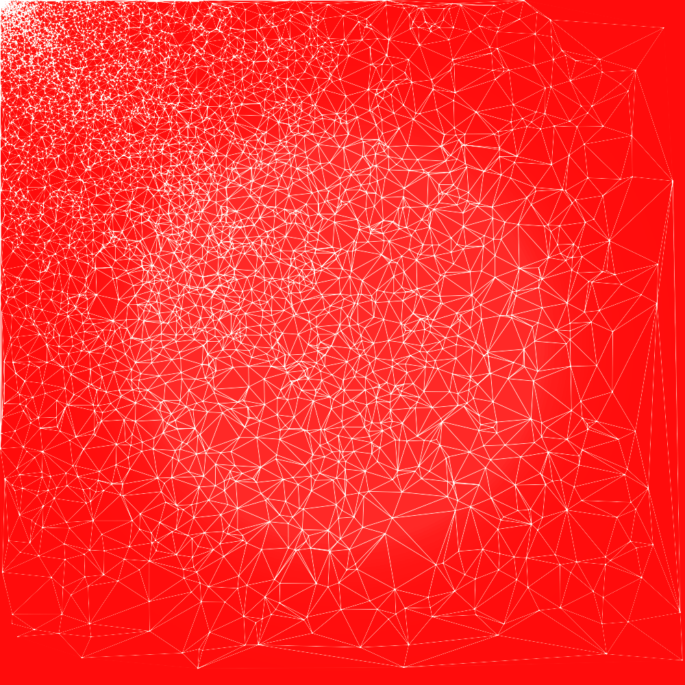
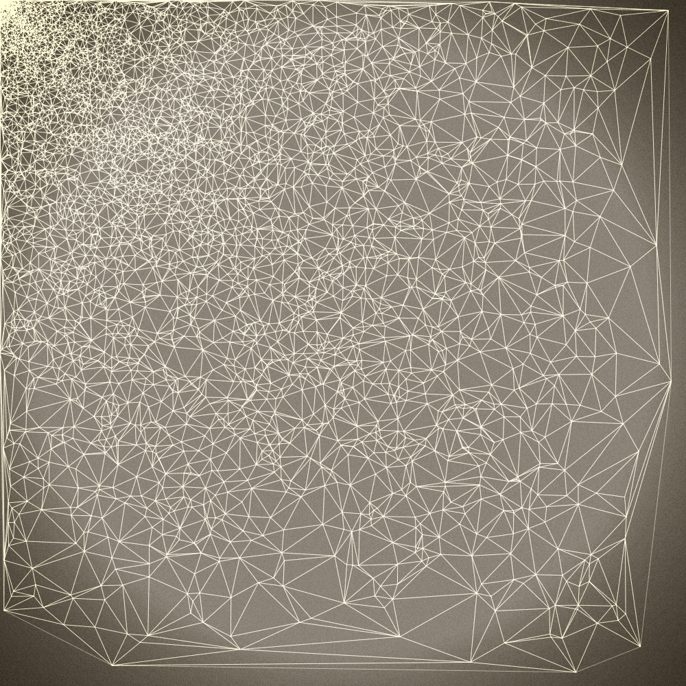

# Webogram

Snap your web pages through Instagram inspired filters. You can use this to generate wallpapers for
phone and desktop, icons, and [book covers](http://leanpub.com/the-little-metrics-book) like
this one:


## Quick start

Install webogram with `npm` (requires Node.js):

```
$ npm install webogram -g
```

Then use one of your visualizations or web pages (D3 visualizations are amazing to render), here's
one of mine:

```
webogram https://bl.ocks.org/jondot/raw/b32e72ecad555658d2cb1ca517e3bcb7/ -s 1000x1000 -f lomo -p
```


Original:



Lomo:




Vintage:




## Options

Here's `webogram --help`:

```
Usage: webogram <url> [options]

Options:
  -s, --size     size of image: WIDTHxHEIGHT, 400x300       [default: "512x512"]
  -d, --delay    delay before snapping                            [default: 200]
  -o, --out      out filename                               [default: "out.png"]
  -z, --zoom     zoom factor to apply                               [default: 1]
  -c, --crop     crop region: TOPxLEFTxWIDTHxHEIGHT, 10x20x500x500
  -p, --preview  preview the image?                             [default: false]
  --filter, -f   choose a filter
   [choices: "vintage", "lomo", "clarity", "sinCity", "sunrise", "crossProcess",
  "orangePeel", "love", "grungy", "jarques", "pinhole", "oldBoot", "glowingSun",
              "hazyDays", "herMajesty", "nostalgia", "hemingway", "concentrate"]
```

Usually you want to play with `size`, provide a big canvas to start from, then
zoom in with `zoom` so that it fills up, and then crop it with `crop`.

You can preview the filters [here](http://camanjs.com/examples/)).


# Contributing

Fork, implement, add tests, pull request, get my everlasting thanks and a respectable place here :).

# Copyright

Copyright (c) 2016 [Dotan Nahum](http://gplus.to/dotan) [@jondot](http://twitter.com/jondot). See [LICENSE](LICENSE.txt) for further details.

